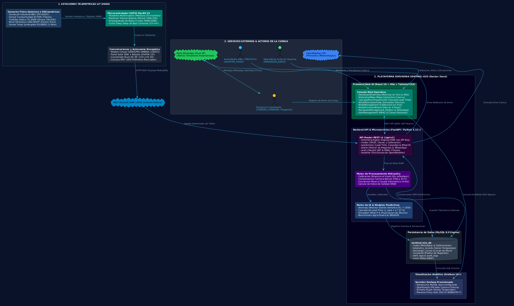
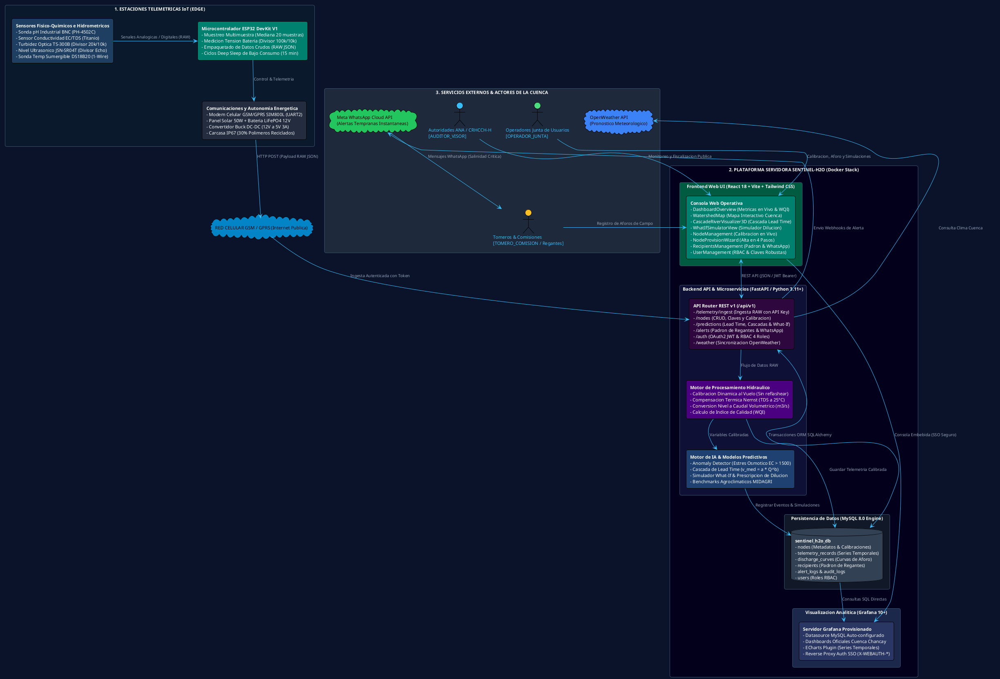

# 🏛️ Sentinel-H2O — Arquitectura del Sistema

> **I Concurso de Ciencia y Tecnología para la Seguridad Hídrica en la Cuenca Chancay-Huaral**  
> **Organizado por:** Autoridad Nacional del Agua (ANA) y Consejo de Recursos Hídricos de Cuenca Chancay-Huaral (CRHCCH-H)  
> **Requerimiento Oficial:** ☑ Arquitectura del Sistema  
> **Licencia:** Open Source (GNU AGPL v3.0)

---

## 1. Diagrama General de Arquitectura (PlantUML / StarUML)

El siguiente diagrama representa la arquitectura multicapa real implementada en la plataforma **Sentinel-H2O**, conectando desde los nodos telemétricos en campo (Edge) hasta la consola web de gobernanza y el despacho de alertas tempranas vía WhatsApp:

---

## 2. Código Fuente del Diagrama (PlantUML / StarUML)

---

## 3. Desglose Técnico de Componentes Reales

### A. Estaciones Telemétricas de Campo (Edge IoT)
- **Microcontrolador ESP32 DevKit V1:** Ejecuta firmware en C++ estructurado en FreeRTOS. Realiza un filtrado de mediana sobre 20 muestras por canal para suprimir perturbaciones electromagnéticas e hidráulicas.
- **Transmisión Agnóstica de Señales RAW:** El nodo no procesa fórmulas rígidas en su memoria interna; transmite directamente voltajes analógicos ($0.0 - 3.3\text{ V}$) y tiempos de vuelo ultrasónicos ($cm$) empaquetados en un payload JSON liviano.
- **Divisores Resistivos de Precisión:**
  - *Batería:* Divisor $100\text{ k}\Omega / 10\text{ k}\Omega$ conectado directo a bornes para sensar hasta $15\text{ V DC}$.
  - *Turbidez:* Divisor $20\text{ k}\Omega / 10\text{ k}\Omega$ (1:3) para atenuar de $4.5\text{ V}$ a $1.5\text{ V}$.
  - *ECHO Ultrasónico:* Divisor $1\text{ k}\Omega / 2\text{ k}\Omega$ para proteger la entrada de $3.3\text{ V}$ del microcontrolador.
- **Gestión de Energía:** Panel solar de 50W, batería LiFePO4 de 12V 12Ah con BMS y convertidor Buck LM2596, operando en ciclos de *Deep Sleep* de 15 minutos para garantizar autonomía continua.
- **Sostenibilidad:** Carcasa IP67 con prensaestopas fabricada con un **30% de polímeros reciclados (rPET/rPEAD)**.

---

### B. Backend API y Microservicios (FastAPI / Python 3.11+)
- **API REST v1 (`/api/v1`)**:
  - `/telemetry/ingest`: Endpoint asíncrono de alta velocidad que valida el `API_KEY` del nodo, ejecuta la calibración en caliente y detecta transgresiones de límites de calidad de agua.
  - `/nodes`: Gestión de inventario de estaciones, rotación de claves y actualización instantánea de parámetros de calibración (`ph_offset`, `ph_slope`, `ec_k_factor`, distancia cero $D_0$).
  - `/predictions`: Motor analítico de cálculo de tiempo de viaje hidráulico (*Lead Time*), cascadas de propagación de contaminantes tramo a tramo, y simulador estocástico *What-If* con prescripción de dilución.
  - `/alerts`: Gestión del padrón de regantes, sectores de riego y despacho de alertas vía Meta WhatsApp API.
  - `/auth`: Autenticación segura con JSON Web Tokens (JWT) y control de acceso basado en 4 roles (`ADMIN_SISTEMA`, `OPERADOR_JUNTA`, `TOMERO_COMISION`, `AUDITOR_VISOR`).
  - `/weather`: Sincronización continua de datos climáticos y pronósticos de la cuenca Chancay-Huaral mediante la API de OpenWeather.

---

### C. Persistencia y Almacenamiento (MySQL 8.0)
- Motor de base de datos relacional desplegado en contenedor Docker con volúmenes persistentes.
- **Tablas Principales:**
  - `nodes`: Metadatos geográficos, cotas msnm y perfiles de hardware.
  - `calibration_profiles`: Factores de conversión analógica-física por estación.
  - `telemetry_records`: Series temporales indexadas con métricas crudas y calibradas.
  - `discharge_curves`: Tablas de aforo y coeficientes de Manning/vertederos.
  - `recipients`: Padrón de usuarios agrícolas, cargos y números validados E.164.
  - `users`: Cuentas con hash bcrypt y control de permisos RBAC.

---

### D. Servidor de Analítica y Dashboards (Grafana 10+)
- Contenedor dedicado con auto-aprovisionamiento de datasources MySQL y tableros oficiales de la cuenca.
- Plugin `volkovlabs-echarts-panel` para gráficos hidro-ambientales avanzados.
- **Autenticación Proxy SSO:** Integrado transparentemente con el backend mediante cabeceras seguras `X-WEBAUTH-*`, sincronizando los roles de los usuarios sin necesidad de doble login.

---

### E. Consola Web Operativa (React 18 + Vite + Tailwind CSS)
- **`DashboardOverview.jsx`:** Monitoreo en tiempo real de los 6 nodos de la cuenca, semaforización de estado y cálculo del Índice de Calidad de Agua (WQI).
- **`WatershedMap.jsx`:** Mapa cartográfico interactivo georreferenciado con las coordenadas reales de las estaciones en la cuenca Chancay-Huaral.
- **`CascadeRiverVisualizer3D.jsx`:** Gemelo visual interactivo que simula el río en 3D, calculando la cascada de tiempos de llegada (Lead Time) y la dispersión cromática de plumas de salinidad.
- **`WhatIfSimulatorView.jsx`:** Entorno interactivo para simular escenarios de estrés hídrico, sequías y cálculo automático del volumen de agua de dilución requerido.
- **`NodeManagement.jsx`:** Directorio de estaciones con panel de **Calibración en Vivo** (permite ajustar sondas sin reprogramar el firmware) y generador de claves.
- **`NodeProvisionWizard.jsx`:** Asistente interactivo en 4 pasos para incorporar nuevas estaciones telemétricas a la red.
- **`RecipientsManagement.jsx`:** Padrón de regantes con validación de teléfonos en tiempo real y selector de alertas.
- **`UserManagement.jsx`:** Gestión de usuarios con medidor visual interactivo de fortaleza de contraseñas y asignación de roles RBAC.
