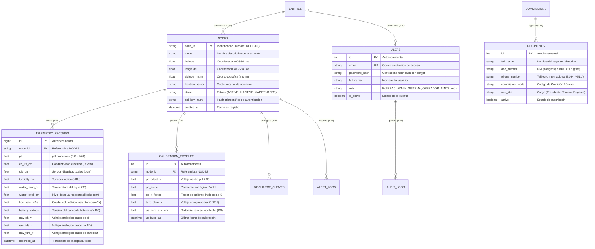

# 🗄️ Sentinel-H2O — Base de Datos y Modelo Relacional

> **Plataforma Abierta de Gemelo Virtual Descentralizado e IoT para la Seguridad Hídrica**  
> **Requerimiento Oficial:** ☑ Base de Datos  
> **Licencia:** Open Source (GNU AGPL v3.0)

---

## 1. Arquitectura de Persistencia

El motor de almacenamiento de **Sentinel-H2O** utiliza **MySQL 8.0** con motor **InnoDB**, optimizado para la persistencia transaccional y la consulta eficiente de series temporales continuas provenientes de las estaciones telemétricas.

### Características Principales:
- **Trazabilidad Doble:** Cada registro almacena tanto las métricas físicas calibradas ($pH$, $EC$, $\text{caudal}$) como los voltajes analógicos en crudo ($V_{\text{raw}}$), permitiendo auditorías ambientales y recalibraciones históricas.
- **Integridad Referencial:** Relaciones foráneas en cascada que garantizan consistencia entre estaciones, calibraciones y perfiles de aforo.
- **Indexación Temporal:** Índices compuestos por `(node_id, recorded_at)` que aceleran las consultas analíticas en rangos de fechas para Grafana y el motor de IA.

---

## 2. Diagrama Entidad-Relación (ERD)

---

## 3. Diccionario de Tablas Clave

### Tabla: `nodes` (Estaciones de Monitoreo)
| Columna | Tipo SQL | Nulo | Descripción |
|---|---|:---:|---|
| `node_id` | `VARCHAR(32)` | NO | Clave primaria. Código identificador único del nodo. |
| `name` | `VARCHAR(128)` | NO | Nombre descriptivo del punto de monitoreo. |
| `latitude` | `DOUBLE` | NO | Latitud decimal en grados ($-90.0 \le \text{lat} \le 90.0$). |
| `longitude` | `DOUBLE` | NO | Longitud decimal en grados ($-180.0 \le \text{lon} \le 180.0$). |
| `altitude_msnm`| `FLOAT` | NO | Altitud topográfica sobre el nivel del mar. |
| `api_key_hash` | `VARCHAR(128)` | NO | Hash SHA-256 para validar las tramas HTTP entrantes del nodo. |

### Tabla: `telemetry_records` (Series Temporales Hidro-Ambientales)
| Columna | Tipo SQL | Nulo | Descripción |
|---|---|:---:|---|
| `id` | `BIGINT AUTO_INCREMENT` | NO | Clave primaria autoincremental. |
| `node_id` | `VARCHAR(32)` | NO | Clave foránea referenciando a `nodes(node_id)`. |
| `ph` | `FLOAT` | SÍ | Potencial de hidrógeno compensado ($0.0 - 14.0$). |
| `ec_us_cm` | `FLOAT` | SÍ | Conductividad eléctrica a 25°C ($\mu S/cm$). |
| `water_level_cm`| `FLOAT` | SÍ | Altura de lámina de agua ($cm$). |
| `flow_rate_m3s` | `FLOAT` | SÍ | Caudal volumétrico computado ($m^3/s$). |
| `raw_ph_v` | `FLOAT` | SÍ | Voltaje analógico leído directamente del ADC ($V$). |
| `raw_tds_v` | `FLOAT` | SÍ | Voltaje analógico leído del sensor de conductividad ($V$). |
| `battery_voltage`| `FLOAT` | SÍ | Nivel de tensión del banco de baterías ($V$). |
| `recorded_at` | `DATETIME` | NO | Marca temporal UTC de la captura física (Indexado). |

---

## 4. Script DDL y Archivos de Inicialización
El esquema completo y las migraciones iniciales se encuentran implementados en:
- **Script SQL:** [`database/schema.sql`](file:///c:/Users/Near/Desktop/Proyecto%20Chancay/database/schema.sql)
- **Modelos ORM:** [`backend/app/database/models.py`](file:///c:/Users/Near/Desktop/Proyecto%20Chancay/backend/app/database/models.py)
